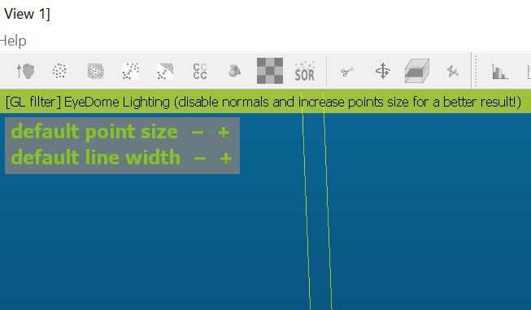
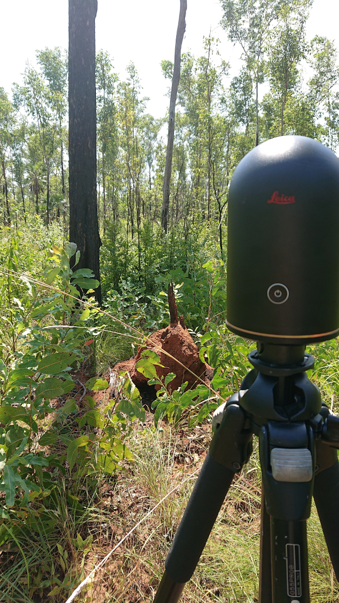
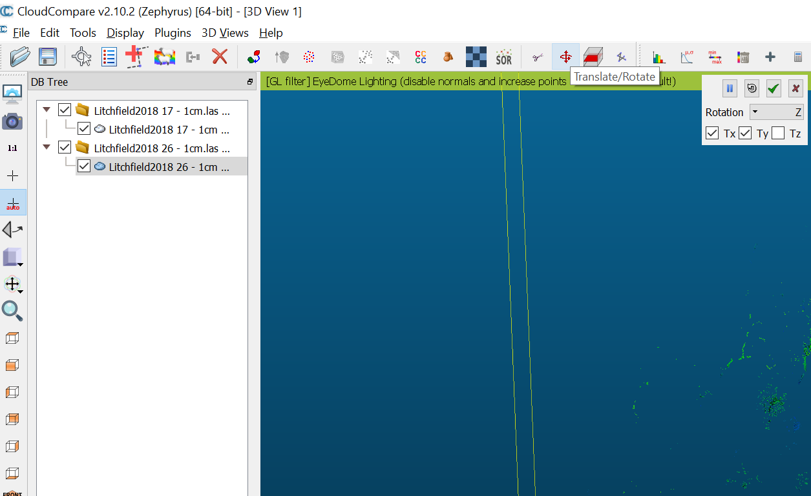
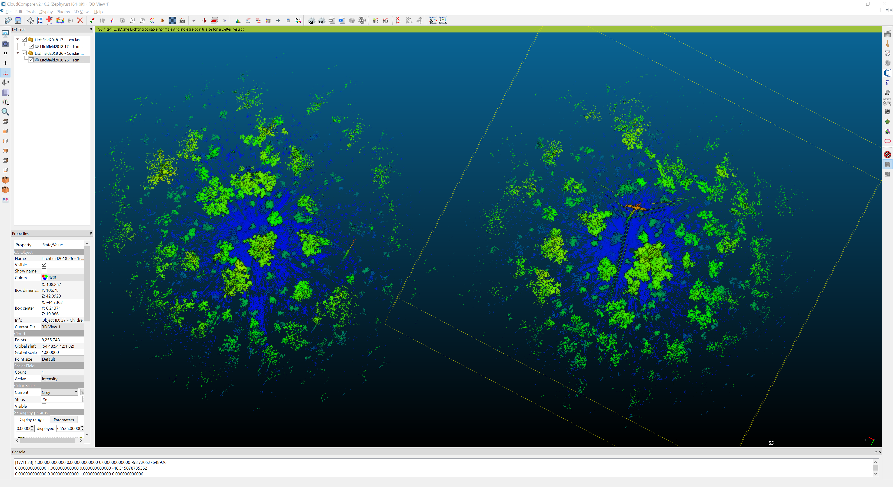

# Introduction to Remote Sensing of the Environment

## Ecological application of TLS

### Prerequisites
---
Completion of this lab exercise requires use of the CloudCompare software package. CloudCompare is a powerful package for visualising and processing point-clouds, and best of all is open-access. You can download the version to match your operating system here:
https://www.danielgm.net/cc/

---
### Background and objective
The objective is to use the skills obtained in Labs 9 and 10 in a real life example. In these Labs you were looking at a likely familiar loation - Boab court at CDU Casuarina campus. In this Lab you have three scans of the field site in Litchfield NP you have seen in the Introduction to LiDAR lecture. 
In this Lab we will align and ***co-register????*** the individual point clouds to produce a single point cloud.

---
## Aligning individual scans
1. Import Scan 17 and inspect the cloud. 

Notice how RGB works better for low points as tree foliage sways and moved between acquisitions.

2. Explore Display settings: 
  * Toggle the ELD filter *(Display -> Shaders & Filters -> EDL filter)*
  * Adjust point size (hover mouse in top left corner of the screen to show menu)

Working with LiDAR data, different settings will be useful for different purposes. During this prac you can adjust display settings to your personal preferences.

Next to the scan point in the centre you will see a termite mound built up on a tree trunk. After this scan was taken large areas of Litchfield NP were subject to bushfires during the last dry season. 

Here is a photo taken during a repeat scan from the same postition. At this stage only a small piece of charcoaled timber remains of this large tree. After another fire there will likely be no evidence of a tree having been here in the first place.

Consecutive LiDAR scans can be useful for quantifying change over time in wooded systems. In this case we can record loss of large trees; other applications include quantification of tree growth or the impact of fire events on the understory.

3. Import Scan 26. For the remainder of this lab I recommend using a height ramp to display the pointclouds. 
    * Select pointcloud in top left panel
    * Change colour to height ramp *(Edit -> Colours -> Height ramp)*
    * Repeat for all pointclouds

As these pointclouds are not georeferenced, CloudCompare will overlap the files.

4. Open the Translate and Rotate tool.
    * Select Scan 26
    * Select Translate/ Rotate tool
    * In the tool deselect Tz
    * From the Rotation drop-down menu select Z

These settings will allow you to move the pointcloud along the x/y-axes and rotate it along the z-axis.

5. Move Scan 26 to the right.
    * Use your **secondady** mouse button to move Scan 26 to the right
    * Click the green tick in the Translate/ Rotate tool to save changes

Inspect each pointcloud closely. Both clouds include a tower and a small shed. Once familiar with the pointclouds you can rotate them to match 
    
    
    
    
    
    
    
