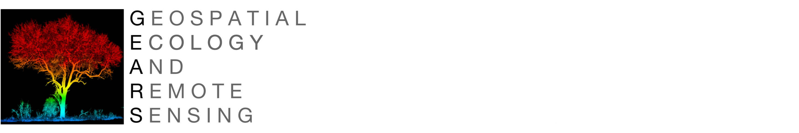
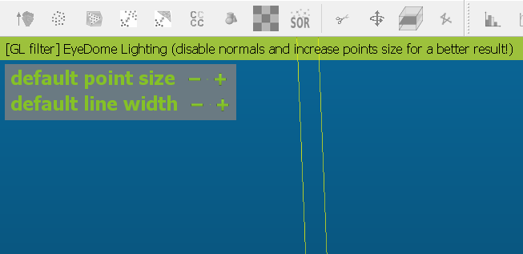
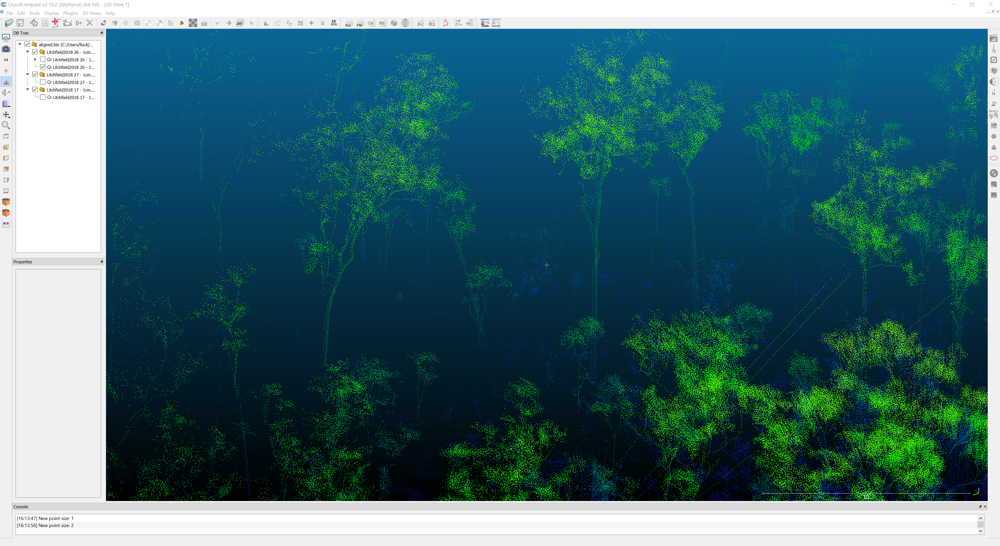

GEARS - Geospatial Ecology and Remote Sensing lab - https://www.gears-lab.com

# Introduction to Remote Sensing of the Environment

## Lab 11 - Working with Terrestrial Laser Scanning (TLS) data in CloudCompare - ecological application

### Prerequisites
---
Completion of this lab exercise requires use of the CloudCompare software package. CloudCompare is a powerful package for visualising and processing point-clouds, and best of all is open-access. You can download the version to match your operating system here:

https://www.danielgm.net/cc/

---
### Background and objective
The objective is to apply the skills obtained in Labs 9 and 10 in an ecological context. In the previous Labs we were looking at a likely familiar location - the Boab court at CDU Casuarina campus. In this lab we will look at scans form the Litchfield NP field site you have seen in the Introduction to LiDAR lecture. We will learn how to align and register multiple clouds and explore how point density affects data quality. Now that we know the technology better, we will use this lab to consider how your study area and your research questoins would guide your sampling strategy.

Scan data can be downloaded in .las format here (file size ~ 260 MB):

[Scan 17](https://charlesdarwinuni-my.sharepoint.com/:u:/g/personal/andrew_edwards_cdu_edu_au/EQfjZZ7CYU1JpqLzQgWIfooBTTOj6_cipHFUVEyhEhmXWQ?e=9IAXIP) | [Scan 26](https://charlesdarwinuni-my.sharepoint.com/:u:/g/personal/andrew_edwards_cdu_edu_au/EZPOSGUUv-xDg5lX5vKdodIBfVSbyztcNzAclHOWDnf_og?e=JA7hkC) | [Scan 27](https://charlesdarwinuni-my.sharepoint.com/:u:/g/personal/andrew_edwards_cdu_edu_au/EYMTyzZ9Lg1LsuzaZJ_VOe0BcAd_tDZzqMAiZGmSOJiSyA?e=BaPITk)

---
## Getting to know CloudCompare

Please see last week's lab here: [Lab 9](https://github.com/geospatialeco/GEARS/blob/master/Intro_RS_Lab9.md)

## Merging multiple point clouds

Please see last week's lab here: [Lab 10](https://github.com/geospatialeco/GEARS/blob/master/Intro_RS_Lab10.md)

## Ecological application
**1. Import Scan 17.**
   * Inspect the cloud

Notice how RGB works better for low points. As tree foliage sways in the wind between acquisition of the RGB image and the point cloud we often get a beautiful sky blue assigned to our tree tops. This scanner is quipped with an RGB camera as it was designed to scan buildings. Knowing its limitations in the field, how could this feature be useful for environmental studies?

**2. Explore Display settings.** 
  * Toggle the EDL filter *(Display -> Shaders & Filters -> EDL filter)*
  * Adjust point size (hover mouse in top left corner of the screen to show menu)

Working with LiDAR data, different settings will be useful for different purposes. During this prac you can adjust display settings to your personal preference.

**Fun fact:** Next to the scan point in the centre you will see a termite mound built up on a tree trunk. After this scan was taken, extensive areas of Litchfield NP were subject to bushfires during the 2019 dry season. 

Here is a photo taken this year during a repeat scan from the same location. At this stage only a small piece of charcoaled timber remains of this large tree. Why was this tree consumed by the fire while the one next to it is still standing? Could the presence of a termite mound indicate extensive hollowing and therefore susceptibility to fire damage?

Consecutive LiDAR scans can be useful for quantifying change over time in wooded systems. In this example we can record loss of large trees and start forming ideas about environmental factors driving this loss that can then be investigated. Other applications include quantification of tree growth or the impact of fire events on the understory. Can you think of other ways in which this amazing data could be used?

**3. Import Scan 26 and adjust display settings.**
   * Select point cloud in top left panel
   * Change colour to height ramp *(Edit -> Colours -> Height ramp)*
   * Adjust point size and shading to what works best for you (e.g. I prefer point size 1 and no shading)

CloudCompare imports the point clouds on top of each other because they are not georeferenced. This is because, unlike other scanners, the Leica BLK360 does not have an inbuilt positioning system. How would this affect your field protocol? 

**4. Configure the Translate and Rotate tool.**
   * Select Scan 26
   * Select Translate/ Rotate tool
   * In the tool deselect Tz
   * From the Rotation drop-down menu select Z

These settings will allow you to move the point cloud along the x/y-axes and rotate it along the z-axis. Feel free to play with the settings and see what else the tool can do - there's always the undo button.

**5. Align point clouds.**
   * Use your **secondary** mouse button to *move* and your **primary** mouse button to *rotate*
   * Click the green tick in the Translate/ Rotate tool to save changes
   * Change the viewing angle and repeat the process for further adjustment

It seems impossible to perfectly line up every last little branch. Trees will sway in the breeze and the scanner might not be set up perfectly horizontally. For the purpose of aligning the scans it’s easiest to focus on the stems. Alignment doesn’t have to be perfect – the ICP tool will finish the job for us. How does knowing the pitfalls of data processing affect your decision about when to scan (e.g. season/ time of day)?

**6. Import and align Scan 27.**
  * Make sure you select the point cloud you want to move/ rotate in the top left panel
  * Get yourself a cuppa if you feel frustration levels are rising

Now that all three point clouds are in place we can correct minor offsets using the ICP tool.

**7. Fine register first point cloud.**
  * Select Scan 26 and Scan 27
  * Open the Clouds registration tool *(Tools -> Registration -> Fine registration (ICP))*
  * Make sure Scan 26 is assigned as reference - click swap if necessary
  * Change final overlap to 30%
  * Click ok

If CloudCompare displays the aligned point cloud in black, just apply the height ramp again. Inspect the alignment - notice how sharp the edges look now. The 30% overlap is an estimate you need to make when registering point clouds. How do you think changing the distance between scan points would affect this setting?

**8. Fine register second point cloud.**
  * Select Scan 26 and Scan 17
  * Repeat the process (make sure final overlap is at 30%)
  * Inspect the result - I'm sure by now you'll appreciate the neat alignment

Notice along the edges of the point cloud how points become more sparse and large patches are blank. How much area a single scan will cover depends on both, the scanner range and occlusion effect of nearby objects (i.e. your equipment and properties of your study site). How do you think your sampling strategy would differ in this wooded area compared to an open grassland?

Along with range and occlusion I have also mentioned point density as variable to be considered. The data we are working with has been subsampled to 1 point cm-2. As the entire plot is comprised of 25 scans I chose this point density as a compromise between computing power and data quality. So let's explore how further subsampling will affect the quality of your data and why point density is an important aspect to consider.

**9. Reduce point density.**
   * Select your favourite point cloud
   * Open the subsampling tool *(Edit -> Subsample)*
   * In min. space between points enter 0.1000
   * Click OK
   * Inspect the result

You have just decreased point density to one point 10 cm-2. You can switch the individual layers on and off to visually inspect the effect of reducing point density. If you compare the properties in the bottom left panel you will see that points have been reduced to a fraction of the original. If you save the subsampled point cloud you will see that file size has also decreased significantly. If your GPU has struggled displaying the data thus far you might find it easier to navigate the subsampled point cloud.

How do you think point density affects the computing power required to deal with the data?

Would the new subsampled point cloud still be useful for measuring DBH?

If DBH wasn't your primary outcome but tree height or stem density - which point density would you choose?

### Thank you

I hope you found this lab useful.

#### Cheers, Linda Luck
